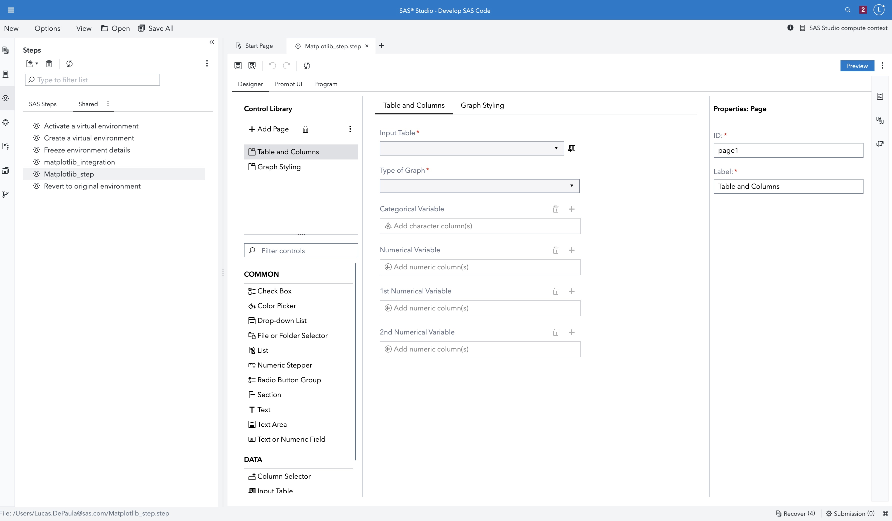
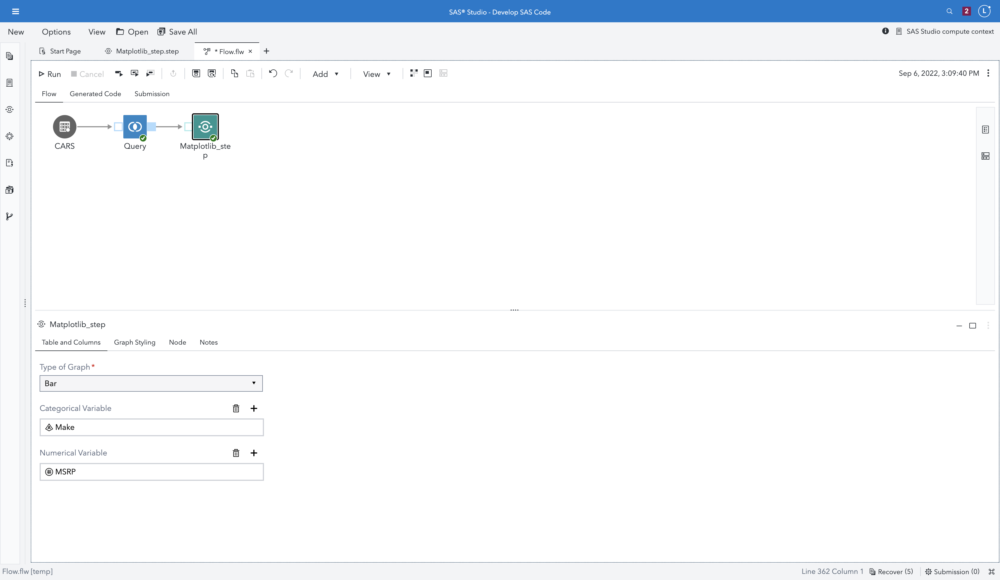
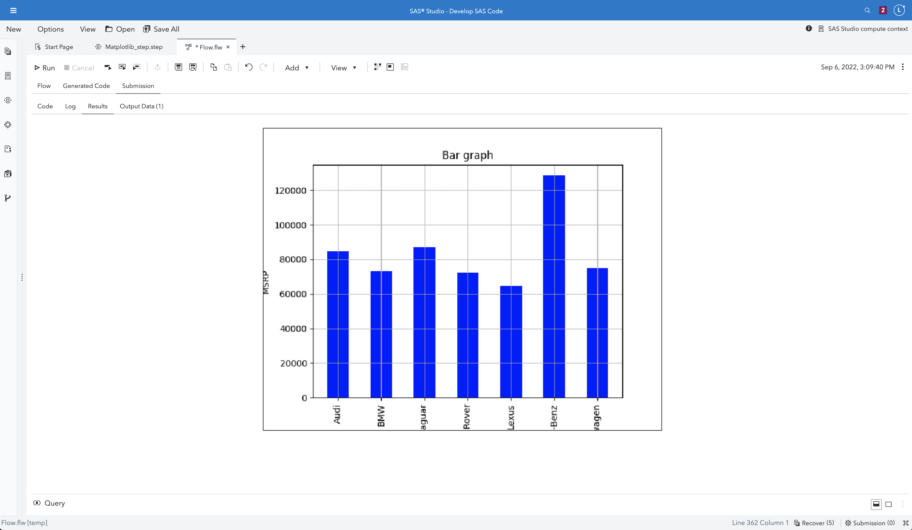

# Python Integration Custom Step

This repository contains a simple Python integration custom step for SAS Studio Flows.

## Usage

First, you will need to import the JSON file. 

1. Go to SAS Environment Manager > Content > [Folder you want] > Click the Import Icon.

2. Go back to SAS Studio and you should see the step on the folder you saved it to.

3. Right click it and select Edit in Design. You should be able to see something like this:

4. Create a new SAS Flow > Add the step to it, and link to a table > Select the input parameters > click run.

5. Navigate to the Submission window and you should see something like this.

# SAS Version

Tested on version Stable 2022.1.4. 

